# Dashboard UX 101
**Create effective dashboard designs**  
September 14, 2021

 

status of dashboard ux 101 doc:

<!--  -->
<!--  -->

<!--  -->

Author: Sharis Shahmiryan

Reviewers: 

- Ashley Evans [X, 2021]
- Maciej Czop [X, 2021]

 

## Contents

This guide includes:

- [What is a dashboard?](#what-is-a-dashboard)
- [Anatomy of a dashboard](#anatomy-of-a-dashboard)
- [Dashboard Chart Types](#dashboard-chart-types)
- [Types of dashboards](#types-of-dashboards)
- [Audience](#who-is-your-audience) 
- [Where to start?](#where-to-start)
- [Dashboard Guidelines – The Good and The Bad](#dashboard-design-guidelines)
  -  [Font](#font)
  -  [Colour](#colour)
  -  [Chart components](#components)
  -  [Hierarchy](#hierarchy)
  -  [Simplicity](#simplicity)
-  [Dashboard Design Checklist](#dashboard-design-checklist)
  
   

> *Numbers have an important story to tell. They rely on you to give them a clear and convincing voice.*   
> ― Stephen Few  

 
  
## What is a dashboard?  

A visual display of the most important information needed to achieve one or more objectives, consolidated and arranged on a single screen so the information can be monitored at a glance.  

 

## Anatomy of a Dashboard  

- **Filters and parameters -** Allow the user to slice and dice the data points.  
- **Top header -** A summary of the goal of your dashboard.  
- **Topline summary metrics -** These numbers lead into more deep-dive information.  
- **Logo -** If the dashboard is to be used within your organization, such as an internal operational dashboard, the size of the logo could be made smaller or placed on the right hand-side so the title stands out.  
- **All charts below the topline summary metrics -** More complex components allow for a deep-dive into the data.  
- **Title -** Should be used as descriptive as possible to give users a sense of what the chart will be about and ensure someone who cannot see the chart can understand the general trends. If needed, you could also add a subtitle to explain the general trends or analysis of the graph.  
- **Labels -** Use labels to call out information. I.e. goals, trends, and important outliers should be highlighted with labels to help the user discern what is going on with the data.  
- **Notes -** If needed, include notes with your chart at the bottom on your dashboard to describe any caveats or inconsistencies with the data.  

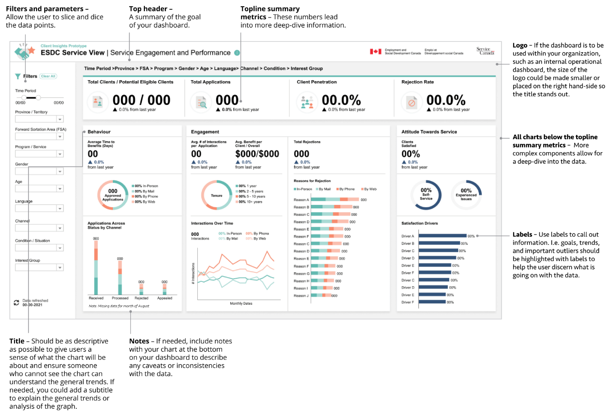

 

## Dashboard Chart Types  
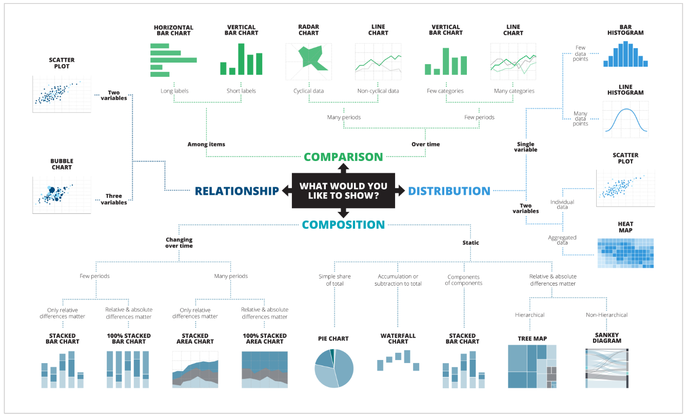  

*Above: Image showing examples of chart types based on the information being displayed (comparison, distribution, relationship, composition)*  

 

## Types of Dashboards

### Operational

- Display data that facilitate the operational side of a business.
- Operational dashboards often require real-time or near real-time data.

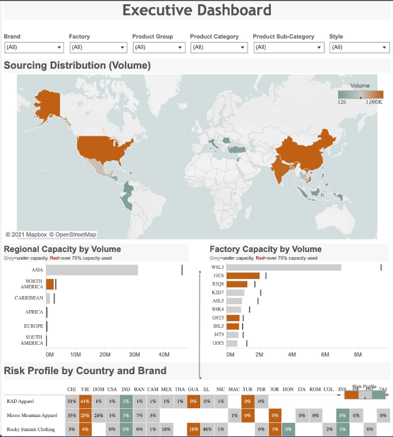

*Example: Supply chain executive dashboard*  

 

### Strategic  

- Provide key performance indicators (KPIs) tracked on a periodic (daily/weekly/monthly) basis, high-level overview of the current state of the business and information on opportunities to the executive team.
- These opportunities could be visualized a using topline summary placed the top of the dashboard. Adding symbols (up and down arrows) to the summary help to indicate increases and decreases.  

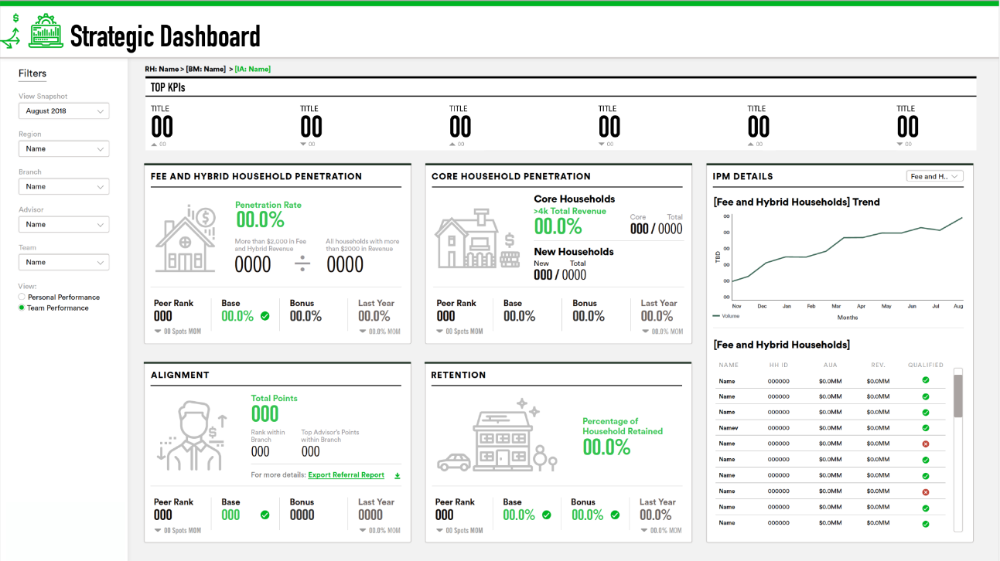

*Example: Management strategic dashboard*  

 

### Analytical / Exploratory  

- Displays operational or strategic data, often with drill-down functionality.
- Allows user to explore more of the data and get different insights.
- Often dashboards include this functionality when it is not required.
- Do not provide this functionality simply because you can.

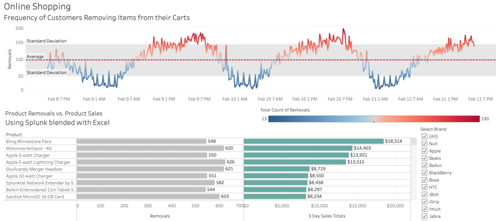

*Example: Online shopping cart analysis*  

 

## Who is your audience?

Consider your audience when creating a dashboard. Answering the questions below could help you gain a better understanding of what is needed to be displayed on your dashboard. 

- Who is your audience?
- What is their familiarity with data visualization?
- How much information do they need?

### Specific users

- If your dashboard is designed with a specific audience in mind, take into consideration their familiarity with the data, visualization types, and terminology used to label and describe data.
- More complex stories could require more complex visuals.

### General users

- If your user group is general, stick with basic and most common language and chart types that people can easily understand. 
- Adding emphasis and labels will help highlight the point of the charts and help to tell the story of the information.
- Consider using multiple simple charts to lead the user through the data step-by-step, rather than one big complex visualization.

 

## Where to start?

Always identify the problem you would like the dashboard to solve and identify the audience for which you are designing.  

Generate ideas to solve the problem and identify the needs or challenges your audience may have.  

- **Not knowing how your dashboard will be used:** Going straight into the build phase without any research could lead to building a dashboard that does not solve the problem you are trying to solve. 
- **Requirement gathering:** Ensure you have all the information you need to build your dashboard. Always include the stakeholders throughout the process. 

 

## Dashboard Design Guidelines

Designing a dashboard is about using data to tell a story that helps your audience get what they need. Any data-driven dashboard must follow a few key design principles to help add clarity and show intent. Whatever tools you choose to use, following these principles will help to create high impact dashboards.  

- **Font:** Use appropriate fonts to increase consistency with the core brand and also to assure legibility and good visual hierarchy of your dashboard.
- **Colour and contrast:** Help clarify relationships between data, provide emphasis for certain data points and maintain a consistent brand voice.
- **Components:** Elements such as clear titles and proper labeling help users quickly understand data visualizations, increase comprehension and contribute to accessibility.
- **Hierarchy:** Use size and position to help emphasize the most important information.
- **Simplicity:** A cluttered dashboard might show a lot of information—but it’s useless if those looking at it can’t understand what they’re looking at. Less is more, so avoid cramming too much on a dashboard. The use of white space improves user comprehension.

 

## Font

### Bad example 

- Do not use a font size smaller than 8pt on a dashboard. The tiny font size makes it hard to read. 
- Text has too much space between each column and no lines between the rows, which makes it harder to scan the information. 
- **Pro Tip:** Use a single font type and no more than three sizes on the dashboard in that type.

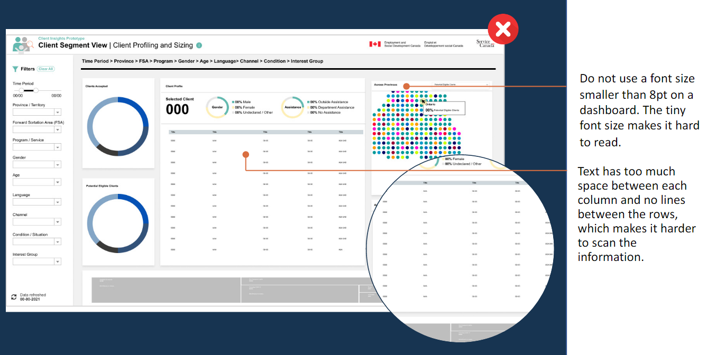

 

### Good example 

- High-level KPIs using large sized numbers give executives a big-picture view of critical success factors.
- All text, data, labels, and titles for dashboards should be in a sans-serif font.
- The lack of serifs in this dashboard, especially on numbers, increases the legibility of small text by eliminating thin serifs. Also, the use of sans-serif fonts cut down on the number of lines and visual clutter.
  - A sans-serif is a category of fonts that do not use serifs, the small lines at the ends of characters.

- **Pro Tip**: Increase consistency with the core brand by following your organizations font style guidelines. ([Service Canada Digital Centre Design System](https://www.figma.com/file/9LVfXvyx75Hh7H6eXrDBL4/Service-Canada-Digital-Centre-Design-System?node-id=3%3A2), [GC Design Library](https://www.figma.com/file/TodbPq5LF1G6l1E3Kx2qPP/GC-Design-Library?node-id=0%3A1))

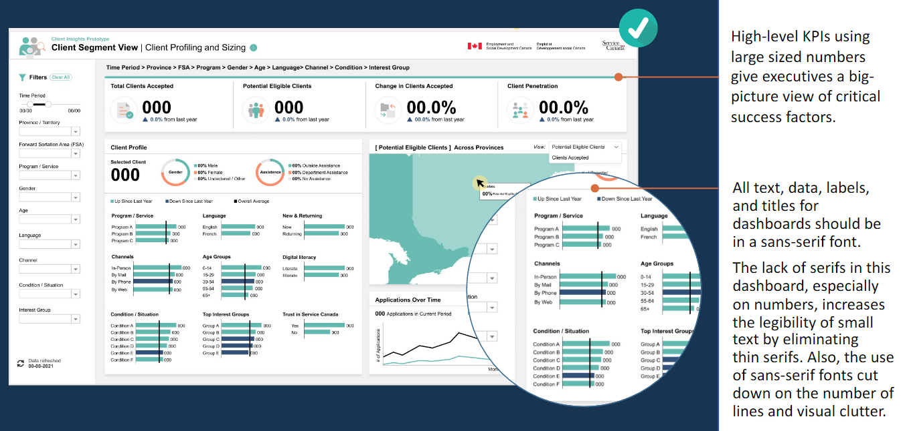

 

## Colour

### Bad example

- Do not use colour without having a purpose for its use. The different coloured backgrounds on this dashboard serve no purpose. 
- Colour on this dashboard, specifically the map, overwhelms the user and makes the data confusing to understand. There are also too many colours. The use of too many colours creates visual overload for your audience, slowing analysis and sometimes preventing it. 
- **Pro Tip:** Before publishing your dashboard, use a [colour blindness simulator](https://www.color-blindness.com/coblis-color-blindness-simulator/) to test your colours to ensure there is contrast between them. 

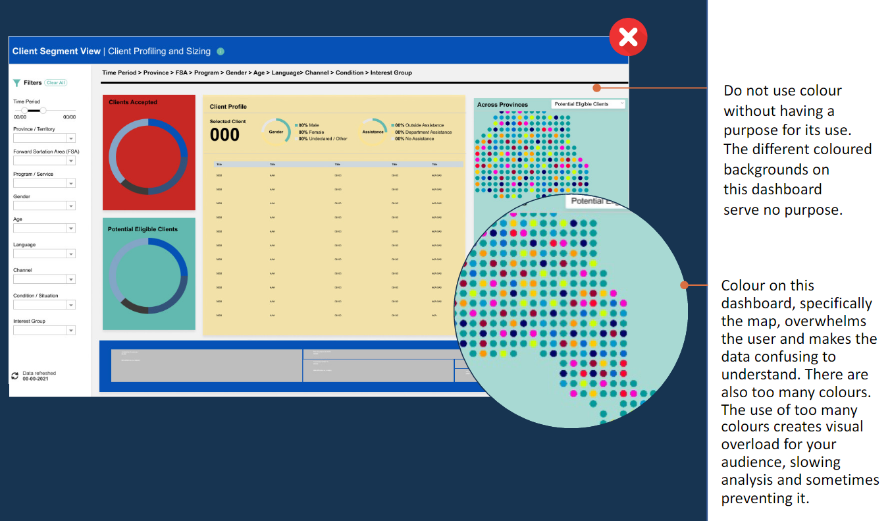

 

### Good example

- Use specific colour combinations to create accessible, on-brand dashboards.
- Using contrasting colours helps account for colour blindness. Also, the colours used in all the charts on this dashboard are consistent. i.e. all teal data represents ‘in-person’ data.
- **Pro Tip:** Use colours to connect information. Choosing the right colours can help connect the different information your dashboard is displaying.

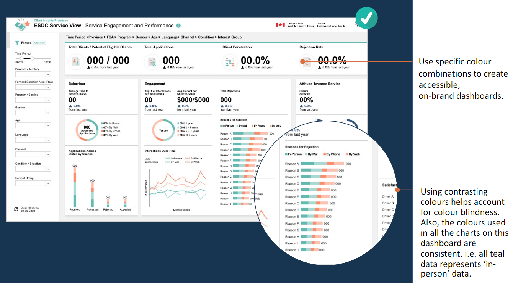

 

## Components

### Bad example

- The goals, trends and important outliers are not highlighted with labels to help the user discern what is going on with the data.
- Do not include charts without numbers and labels on your dashboard.
- **Pro Tip:** Whenever possible, place labels directly on the chart. Direct labeling reduces the cognitive burden for a user by preventing them from having to hunt for labels or try to connect colour meaning to the data.

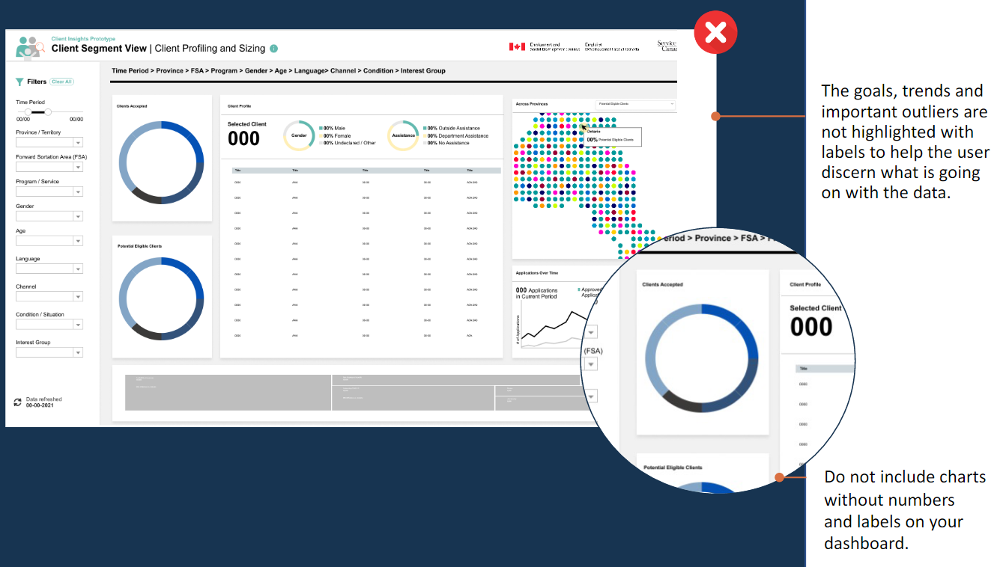

 

### Good example

- The user can scan this dashboard in under 10 seconds and understand the story it is trying to tell because of the inclusion of descriptive titles.  
- Increase the comprehension of your dashboard by using all the dashboard components.
- **Pro Tip:** Use heading and titles on your dashboard to tell a compelling story.

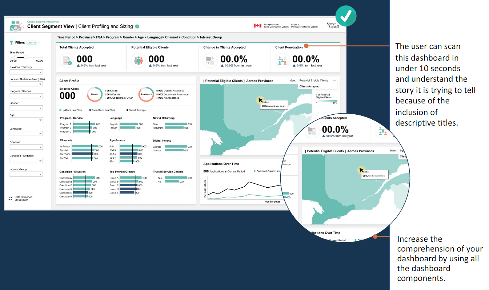

 

## Hierarchy

### Bad example

- Do not place each visualization on your dashboard into an equally sized box. 
- The dashboards layout is hindered by the fact that it is based on a grid. Each component fits into an equally sized box, however not all components should be equally sized. 
- **Pro Tip:** The elements on your dashboard you want to have the most emphasis on should have the most weight. 

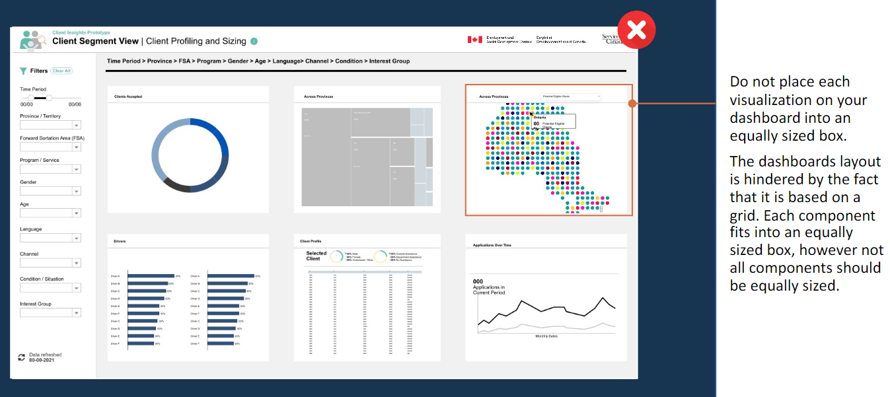

 

### Good example

- Take the squint test to give you a sense what your users will likely identify first. 
- This dashboard uses progressive disclosure, an interaction design technique to help maintain the focus of a user’s attention by reducing clutter, confusion and cognitive workload.
- **Pro Tip:** Use the inverted pyramid approach (a technique used in journalism) to display the most significant insights on the top part of the dashboard, trends in the middle and granular details in the bottom.

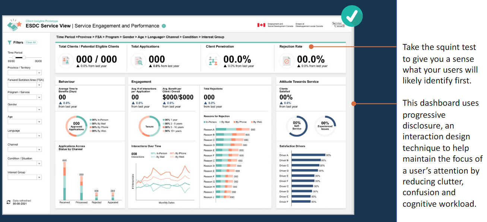

 

## Simplicity

### Bad example

- White space should be added  between each chart to give the eye a place to rest and to give the components on the dashboard more impact. 
- The overuse of white space on this dashboard makes the dashboard components feel disconnected. 
- **Pro Tip:** To maintain a strong hierarchy and create white space, text that shows similar information should be the same size and style.

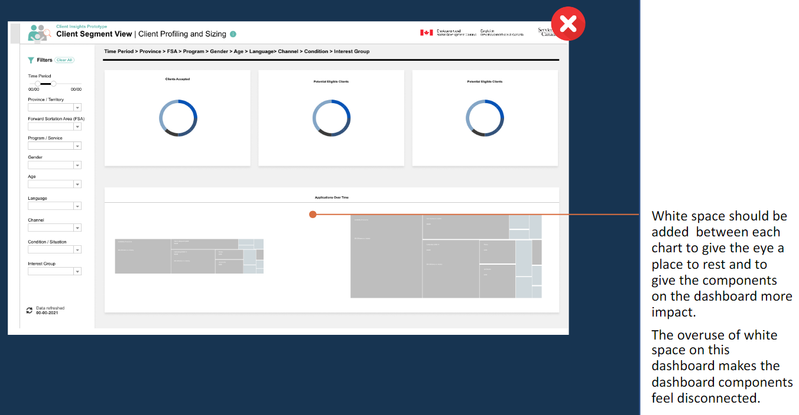

 

### Good example

- Effective use of white space makes reading the content/data easily scannable and significantly improves legibility. Once the information is easily scannable and legible, it will help to clearly communicate the story you would like the dashboard to tell. It also helps to increase the probability of interaction by making the drilldowns menus and buttons on the dashboard stand out and easy to see. 
- Use strong grouping and separation between items.
- **Pro Tips:**
  - Choose a single text alignment to make it easy to tell how the titles relate to each charts. Left-alignment helps to add white space between elements.
  - Use the Law of Proximity (objects placed in proximity to one another will be seen as a group rather than as individual parts) to help organize all the information and help guide the user through logical grouping. Use margins and gutters between grids to group information in the layout.

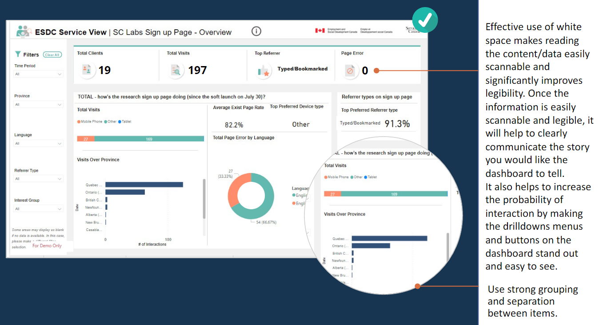

 

## Dashboard Design Checklist

Go through the chestlist below as you build your dashboard.  

- **User persona:** Describe the target audience for the product or service, based on rigorous research and analysis.
  - Who is your audience?
  - What is their familiarity with data visualization?
  - How much information do they need?
- **Story map:** Identify and map specific data and analytics requirements to support prioritized use cases (personas, use cases, KPIs, metrics, required data). 
  - Do you have all your data and analytics requirements?
  - What type of dashboard will you be creating?
  - What is the source of the data?
  - What is the language that will be used?
- **Rapid prototype:** Create mock-ups (hand drawn sketches) so stakeholders can see and react to a product before it is built in production.
  - How will you create the structure of the dashboard?
  - What is the structure of the dashboard?
- **Wireframe:** Visualize functionality by designing the layout. This helps the stakeholders better understand the end-state product and requirements. 
  - Is this an accurate way to represent this data?
  - Will someone else look at the dashboard (charts/data) for feedback?
  - Have all stakeholders approved the wireframe(s)?
- **Accessibility:** Ensure the experience meets required standards.
  - Have you tested your dashboard to ensure it’s accessible?
- **Testing:** Test design assumptions and prototypes early and often.
  - What improvements can be make on the dashboard? 
- **Style guide:** Create a document that outlines a set of design guidelines that arise from the design process.
