# Databricks vs Synapse Spark Pool Comaprison

Authors: Arpit Dhindsa

## Overview

This "Lessons Learned" document is meant to be a repository of institutional memory for hard-won insights and understanding around the tools and technologies used to develop the SAEB architecture.                              

## Context
Apache Spark is a unified engine designed for large-scale distributed data processing. It incorporates libraries for machine learning, SQL for interactive queries and stream processing for interactive real-time data and graph processing. The two main tools in Azure Cloud that provide Spark as a service are Azure Databricks and Azure Synapse. 

Azure Databricks is a collaborative Apache Spark-based Big Data analytics platform 

Azure Synapse is an analytics service that brings together enterprise data warehousing and Big Data analytics.

## Goals
To better understand the differences between these two tools in how they leverage Spark (Python), tests were conducted to capture the differences of:
- Performance
- Cost
- Usability by a Data scientists

## Comparison
The document below outlines key differences between the two Spark services in Azure Cloud.

### Cluster/Spark Pool Setup
In Synpase Analytics, spark applications run on a Apache Spark Pool. Currently, we can only create pools with Memory Optimized nodes and choose from one of two available Spark versions: _Spark 2.4_ and _Spark 3.1_. There are 6 different node sizes available from Small (4vCores / 32 GB) to XXLarge (64 vCores / 432 GB).

Whereas in Databricks, we run spark applications on a cluster. The three available cluster modes are Single Node, Standard and High Concurrency. There are multiple Databricks Runtime Versions to choose from having different Scala and Spark versions. Additionallly, there is large selection of different worker types.

### Notebook Evironment
Databricks provides collaborative notebooks with real time co-authoring and automatic versioning. Whereas Synapse requires you to save the changes to your notebook before the other person can see them. There is no automatic versioning in Synapse notebooks.

### Git Integration
Both services offer GIT integration.

### Performance/Speed
To test the performance of Synapse and Databricks Spark, NYC Taxi & Limousine Commission's - yellow and green taxi trip datasets were used from Azure ML Open Datasets. All yellow and green taxi trip records, from January 2015 to December 2020 were used for performance testing. 

To have same testing conditions for both the technologies, a similar Spark Pool and Databricks cluster were provisioned. Synapse Spark Pool with 3-15 nodes, each node with 64 GB RAM and 8vCores (medium size) with Autoscaling enabled was created. Similarly, a cluster with Databricks Runtime 9.0 (having Spark version 3.1) and 3-15 memory-optimized workers/nodes, each with 64 GB RAM and 8vCores with autoscale enabled was created.

To test the services from Data Scientist's perspective, a linear regression model was built and trained on yellow taxi dataset that predicts the tip amount.

First step of testing was reading data for yellow taxi from Jan 2015 to Dec 2020 and loading them in spark dataframe. The dataset consisted of 538,036,933 records.

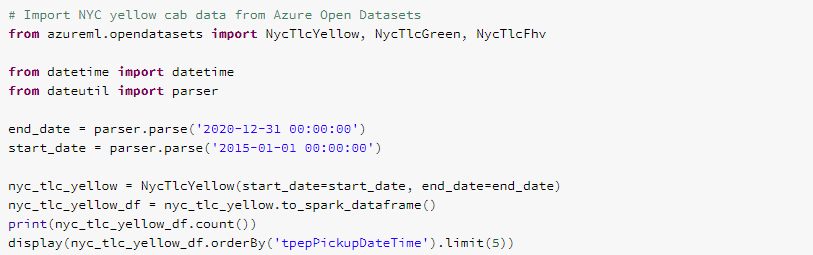

In Databricks this took 2.22 minutes and in Synapse it took 2 min 54 sec that is 2.90 minutes.

Then data transformations and feature engineering (addition of columns, removing outliers) was performed on the data. The categorical (string) variables were converted to numbers using One Hot Encoder. The resulting dataframe consisted of 527,843,708 records.

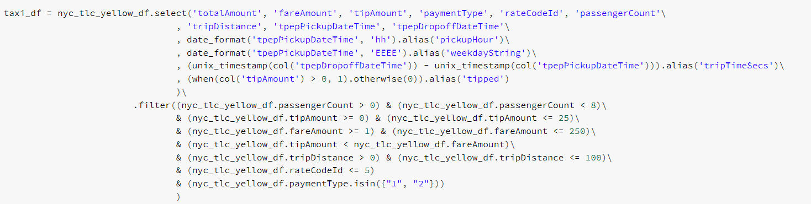

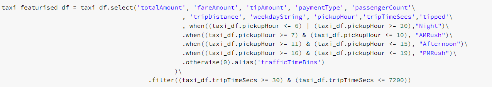

This process took 3.79 minutes in Databricks and 4 min 57 sec in Synapse that is 4.95 minutes.

Next, training and testing datasets were generated using 70-30 split (70% train set, 30% test set). With this the train and test set had 369,502,368 records and 158,341,340 records respectively.

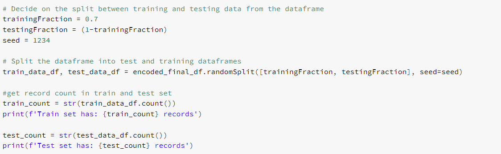

This took 3.29 minutes in Databricks and 10 min 58 sec (10.97 minutes) in Synapse. That is three times slower than Databricks.

Then Logistic Regression model was trained and evaluated using Area under ROC as the metric.

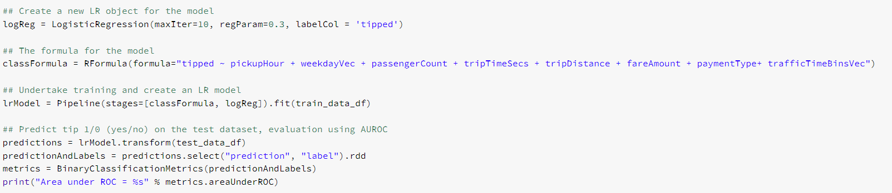

Model training took 10.29 minutes in Databricks whereas in Synapse it took 39 min 47 sec (39.78 minutes). That is almost four times slower than Databricks.

Plotting the ROC curve took 3.20 minutes in Databricks .

Doing the same in Synapse took 27 min 42 sec (27.70 minutes). That is more than 8.5 times slower than Databricks.

To test join permformance, green taxi dataset was used consisting of 59,464,679 records. First the data was read and transformed to make it join ready. In this process yellow taxi dataset was also modified and engineered. Total of two joins were performed.

Reading green taxi dataset took 1.00 minutes in Databricks but, 1 min 10 sec (1.17 minutes) in Synapse.

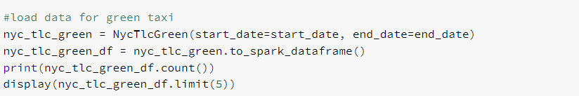

The green taxi dataset was tranformed as follows.

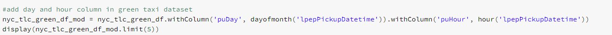

Similarly, yellow taxi dataset was tranformed as follows.

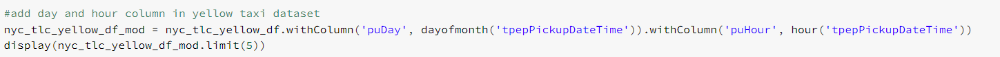

Then yellow and green taxi datasets were aggregated to take mean, median and sum of totalAmount, tipAmount, fareAmount, passengerCount, tripDistance and joined on hour, day, month and year. The resulting dataframe had 39,408 records.

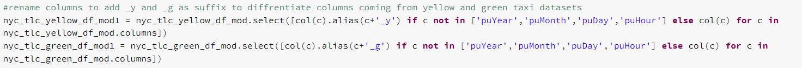

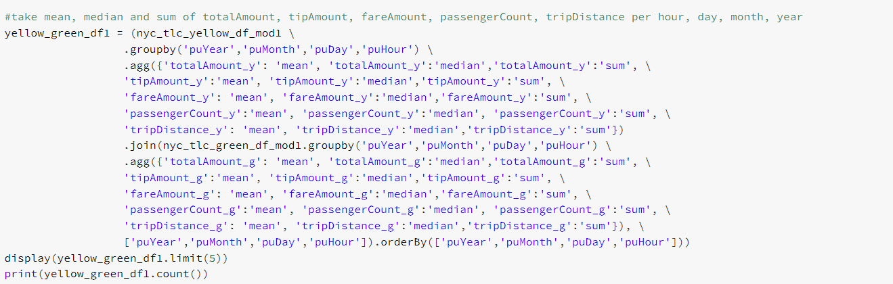

This took 4.94 minutes in Databricks and 4 min 16 sec (4.27 minutes) in Synapse.

Next the datasets were aggregated to take mean, median and sum of totalAmount, tipAmount, fareAmount, passengerCount, tripDistance and joined on pickup and dropoff location (trip path), per hour, day, month, year. The resulting dataframe had 4,023,107 records.

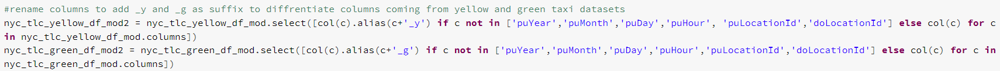

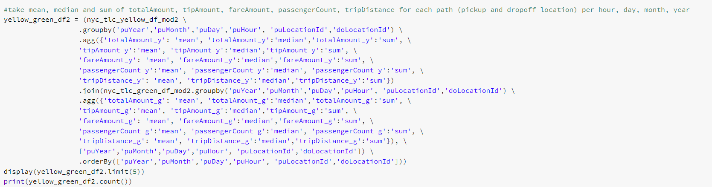

The join took 5.59 minutes in Databricks and 5 min 37 sec (5.62 minutes) in Synapse.

Lastly, writing second joined dataframe to Azure Data Lake Storage took 4.61 minutes in Databricks whereas writing from Synapse took 3 min 9 sec (3.15 minutes).

Writing yellow taxi and green taxi dataset to the storage took 1.68 minutes and 31.05 seconds respectively in Databricks. In Synpase, it took 5 min 17 sec (5.28 minutes) to write yellow taxi data and 1 min 6 sec (1.1 minutes) to write green taxi data.

### Machine Learning
Azure Synapse has built-in support for Azure ML to operationalize Machine Learning Workflows and built-in support for MLflow. However, it does not provide GPU-enabled clusters. Databricks also provides ML optimized Databricks runtimes which include machine leaning libraries like TensorFlow, PyTorch, Keras, etc., GPU enabled clusters and hosted version of MLflow. Databricks can also be integrated with Azure ML.

### Pricing
For both services, pricing is based on the number of virtual machines provisioned and their sizing. With Databricks, there is an additional fee for Databricks Units (DBUs). A DBU is a unit of processing capability, billed on a per-second usage. The DBU consumption depends on the size and type of instance running Azure Databricks. 
See these links for [Databricks](https://azure.microsoft.com/en-ca/pricing/details/databricks/) and [Synapse](https://azure.microsoft.com/en-us/pricing/details/synapse-analytics/) pricing.

For the Databricks cluster used in testing it costs . For Synapse Spark Pool the cost is .

## References
[Databricks Notebook](https://adb-374346146549270.10.azuredatabricks.net/?o=374346146549270#notebook/1003328143883228/command/1003328143883232)

[Synapse Notebook](https://web.azuresynapse.net/en-us/authoring/explore/workspace/notebooks/Data%20Exploration%20and%20ML%20Modeling%20-%20NYC%20taxi%20predict%20using%20Spark%20MLlib?workspace=%2Fsubscriptions%2F19bddd49-8e73-4699-930d-74baa7e5751e%2FresourceGroups%2FSAEB-AnalyticsPlatform-Dev%2Fproviders%2FMicrosoft.Synapse%2Fworkspaces%2Fsynw-saeb-dev-01&relativePath=authoring%2Fanalyze&sparkPoolName=AspApDev01&livyId=0)

