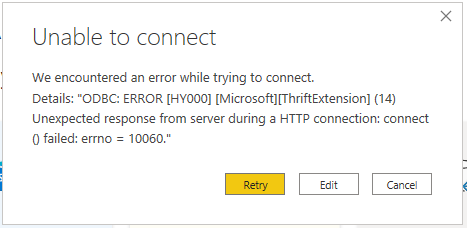
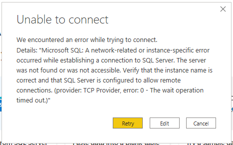

# Power BI Firewall Blocker

Authors: Arpit Dhindsa

## Overview

This "Lessons Learned" document is meant to be a repository of institutional memory for hard-won insights and understanding around the tools and technologies used to develop the SAEB architecture.                              

## Context

Currently there is a problem with PowerBI connections being blocked on some firewall. Regardless of the data source (whether its Databricks Spark Tables or Synapse Analytics), Power BI Desktop is required to create reports. In order to build these reports in Power BI Desktop requires establishing connection to these sources which fails with an error due to firewall setup.

Attempting to connect Power BI desktop with Azure Databricks using Azure Databricks connector and Spark connector results in the following error

Additionally, attempting to connect Power BI Desktop to Synapse SQL DW using Azure Synapse Analytics connector and the SQL Server Database connector also results in the following error

Resolving this issue will involve stakeholders form both ESDC and SSC so, the focus of this exercise is to discover the possible workarounds to the problem before seeking networking help to open Ports and IPs in the Firewall.

## Goals
The goal of this exercise is to have a reliable solution in place. 

To do this, following questions need to be answered.
- What is the suggested workaround? What other workarounds might there be?
- What are the implications of the workaround?
- Is it sustainable? For how long?
- How will it effect the SAEB architecture? 
- Will it have security implications? 
- What is the firewall blocking? 
- What can we determine on our own though debugging tools?
- What do we actually need help determining? Who, might that be?

## Suggested Workaround
### Connecting to Azure Synapse and Databricks off VPN
One workaround is to connect to Azure Synapse Analytics or Databricks Spark Tables from Power BI Desktop off-network (off-VPN) to build reports. Once the report has been created, log back into VPN and upload the report on Power BI Report Server so, it can be viewed by other memebers of the team.

This workaround was used for the Nov29 deliverable.

The implication of this workaround is that if access to ESDC Azure gets restricted to VPN, then the user will not be able to connect to the source and create Power BI reports as Power BI Desktop application running on VPN cannot establish connection to these services to date due to firewall setup.

## What is Firewall blocking?
The firewall on ESDC network doesn't allow outogoing communication on TCP port 1433. However, the firewall on local computer seems to be allowing outgoing communication to TCP port 1433 since Power BI can connect to Synapse Database off VPN.

To connect to SQL resources (dedicated SQL pools and serverless SQL pool) in Synapse workspace using Power BI, we need to make sure that the firewall on network and on local computer allows outgoing communication on TCP ports 1443. Additionally, we need to also allow outgoing communication to TCP ports 80 and 443. See this [Microsoft documentation](https://docs.microsoft.com/en-us/power-bi/connect-data/service-admin-troubleshooting-scheduled-refresh-azure-sql-databases) for reference.

## Possible Solutions/Debugging

### Whitelist Microsoft Azure IPs to connect to the Azure services and resources
To allow Power BI to connect to Azure services and resources, we need to open inbound connection to the list of Azure IP addresses allowing them to go through the firewall. Downside of this solution is that IP addresses can change without notice. However, Mircosoft updates the [json file](https://www.microsoft.com/en-us/download/details.aspx?id=56519&ranMID=24542&ranEAID=je6NUbpObpQ&ranSiteID=je6NUbpObpQ-UUhkK.v_wV9lbeB1kw8tIw&epi=je6NUbpObpQ-UUhkK.v_wV9lbeB1kw8tIw&irgwc=1&OCID=AID2200057_aff_7593_1243925&tduid=%28ir__t3q9fdx3vokf6y2olaqnlfwxif2xo6fy6zz3iq6r00%29%287593%29%281243925%29%28je6NUbpObpQ-UUhkK.v_wV9lbeB1kw8tIw%29%28%29&irclickid=_t3q9fdx3vokf6y2olaqnlfwxif2xo6fy6zz3iq6r00) containing IPs weekly so, to avoid updating the IPs manually, we can write a script that downloads the file and parses it and adds them to firewall rules. This process requires involvement from sercurity team to open up the IPs listed in json file. 

To avoid opening up the IPs that can change regularly, you can make use of Fully Qualified Domain Names (FQDN). These can be found in this guide by Microsoft. The advantage to using this approach is that FQDNs remain same while IPs pointing to FQDN can change.

If ESDC uses fixed set of public IPs for outbound communication then you need to open inbound connection to those specific IPs and add them to Azure SQL instance's firewall rules. 

### Configure a Azure VM and data gateways in the Power BI service
Alternatively, configuring VNets and the Power BI Gateway (in a VM) provides secure access between Power BI and Azure SQL database without opening up the firewall to all Azure Services. The steps on how to set this up are listed in this [Microsoft blog](https://devblogs.microsoft.com/premier-developer/secure-access-to-azure-sql-servers-for-power-bi/).

## Resources
- https://docs.microsoft.com/en-us/azure/synapse-analytics/security/synapse-workspace-ip-firewall
- https://community.powerbi.com/t5/Service/Whitelisting-of-PowerBI-IP-address-range-in-Firewall/m-p/1072193
- https://community.powerbi.com/t5/Service/Mass-IP-Whitelisting-for-Azure-Datacenter/m-p/173665

