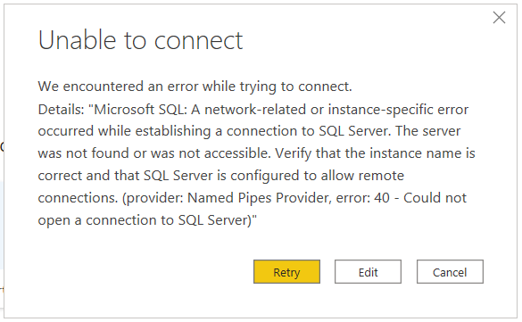
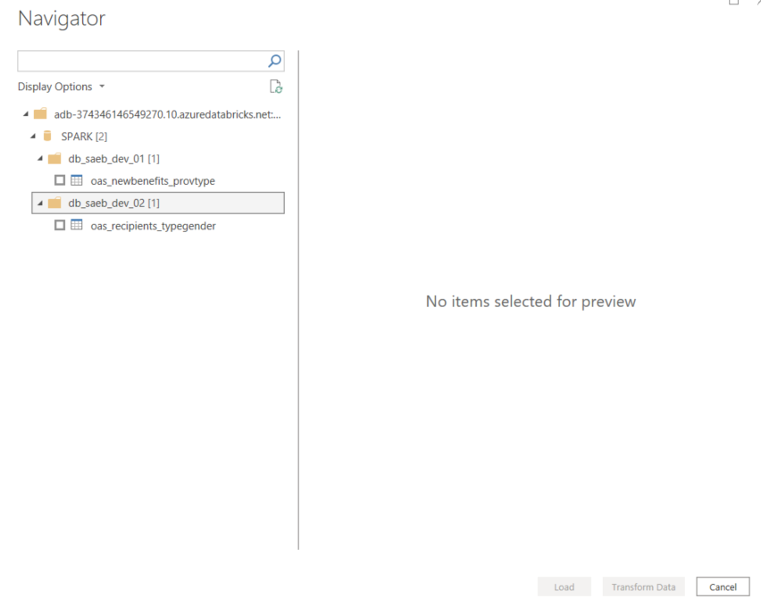
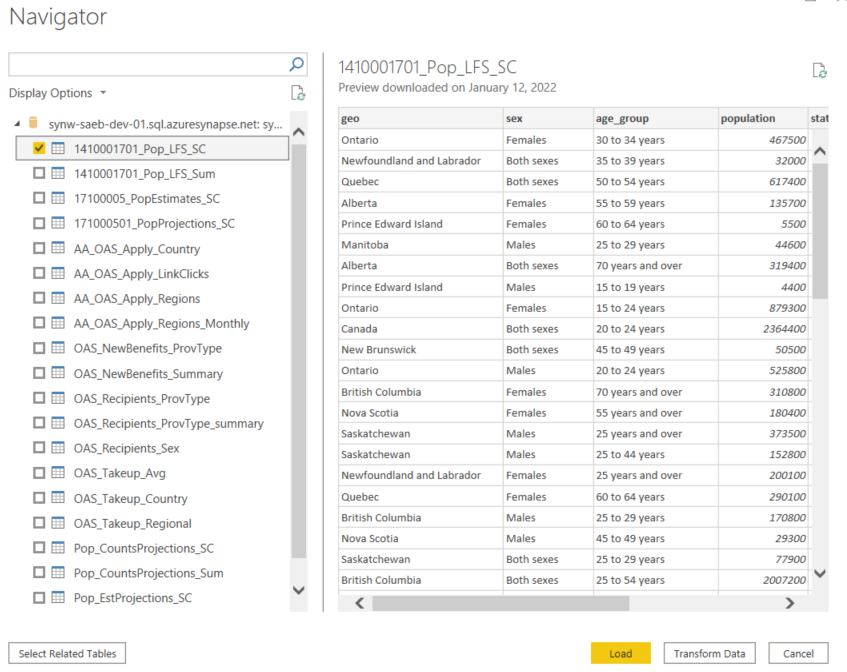
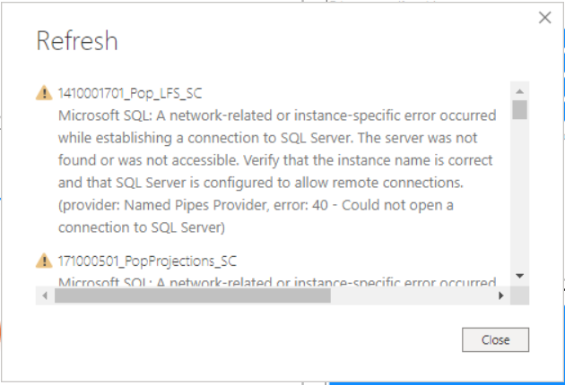
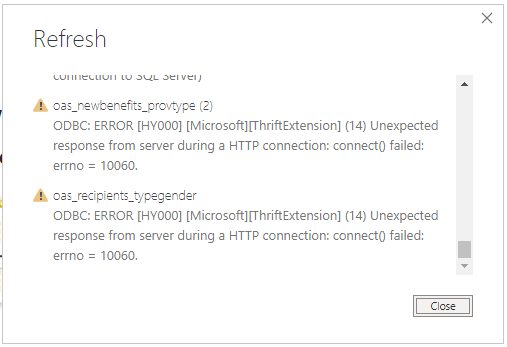
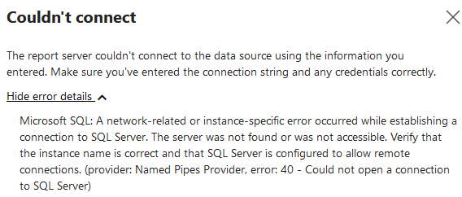

# Power BI Firewall Blocker

Authors: Arpit Dhindsa

## Overview

This "Lessons Learned" document is meant to be a repository of institutional memory for hard-won insights and understanding around the tools and technologies used to develop the SAEB architecture.                              

## Context

Currently there is a problem with Power BI connections (Databricks or Synapse Analytics connector) being blocked on firewall. Power BI Desktop is the tool required to create reports however, this requires establishing connection to these sources which fails due to firewall setup on ESDC network.

Attempting to connect Power BI desktop with Azure Databricks using Azure Databricks connector and Spark connector results in the following error

Additionally, attempting to connect Power BI Desktop to Synapse SQL DW using Azure Synapse Analytics connector and the SQL Server Database connector also results in the following error.

One cannot connect to these sources directly from www.powerbi.com, as the service directs you to Power BI desktop to connect to the source. 

Synapse Studio allows to use data inside Synapse Analytics to create reports inside Power BI. This is done upon creating a Power BI workspace/linked service and then clicking _New Power BI dataset_ on _Power BI datsets_ page listed under _Power BI_ section in the _Develop_ tab, which automatically lists the available SQL Pools inside Synapse Analytics and the respective downloadable data source file that automatically opens in Power BI Desktop to establish connection to Synapse SQL DW as the data source has to be created from a Power BI Desktop. Similarly, this also results in the following error.

Resolving this issue will involve stakeholders form both ESDC and SSC so, the focus of this exercise is to discover the possible workarounds to the problem before seeking networking help to open Ports and IPs in the Firewall.

## Goals
The goal of this exercise is to have a reliable solution in place. 

## What is Firewall blocking?
The firewall on ESDC virtual network and virtual desktop doesn't seem to allow outgoing communication on TCP port 1433. However, the firewall on ESDC provided machine seems to be allowing outgoing communication to TCP port 1433 since Power BI can connect to Synapse Dedicated SQL Pool when disconnected to VPN.

To connect to SQL resources (dedicated SQL pools and serverless SQL pool) in Synapse workspace using Power BI, we need to make sure that the firewall on network and on local computer allows outgoing communication on TCP port 1443. Additionally, we need to also allow outgoing communication to TCP ports 80 and 443. See this [Microsoft documentation](https://docs.microsoft.com/en-us/power-bi/connect-data/service-admin-troubleshooting-scheduled-refresh-azure-sql-databases) for reference.

## Suggested Workarounds
### 1. Connecting to Azure Synapse and Databricks from ESDC machines off VPN
One workaround to building Power BI reports is to connect to Azure Synapse Analytics and Databricks Spark Tables from Power BI Desktop on ESDC provided laptop disconnected from VPN. Once the report has been created, you will need to log back into VPN and upload the report on Power BI Report Server so, it can be viewed by other memebers of the team.

This workaround was used for the Nov29 deliverable. If connection to these sources is unpermitted off-VPN, then users will not be able to create Power BI reports with these sources. Power BI Desktop application running on ESDC provided laptops connected to VPN and ESDC provided equipment (like virtual desktop, ex. SAVE-D) cannot establish connection to these services to date due to firewall setup.

To connect to **Azure Databricks** from ESDC provided machine disconnected from VPN, the steps involved are:
1. Start Power BI Desktop.
2. Click Get data or File > Get data.
3. Click Get data to get started.
4. Choose the Azure Databricks connector, and click Connect.
5. Get and enter Server Hostname and HTTP Path from JDBC/ODBC tab under Advanced Options on the Databricks Cluster page. 
6. Select your Data Connectivity mode. 
7. Click OK.
8. Select Azure Active Directory for authentication and sign in with ESDC Username/Password. Other authentication methods include Azure Databricks Personal Access Token and Windows Login.
9. Click Connect.

Once the connection is established, you should be able to select the Azure Databricks data to query from the Power BI Navigator.

To connect to **Azure Synapse Analytics** from ESDC provided machine disconnected from VPN, the steps involved are:
1. Start Power BI Desktop.
2. Click Get data or File > Get data.
3. Click Get data to get started.
4. Choose the Azure Synapse Analytics connector, and click Connect.
5. Get and enter Server and Database from JDBC connection string of Dedicated SQL Pool Resource in Azure Portal. 
6. In Advanced Options, select _Include relationship columns_
7. Select your Data Connectivity mode. For real-time access to information in your Azure Synapse Analytics, use DirectQuery. 
8. Click OK.
9. Select Microsoft Azzount and enter ESDC Username/Password for authentication. Other authentication methods include SQL Login (SQL admin username and password) and Windows Login.
10. Click Connect.

Once the connection is established, you should be able to select the Synapse Analytics tables to query from the Power BI Navigator.

To upload a report to **Power BI Report Server**:
1. Navigate to [ESDC Report Server](https://pvt-pov.service.gc.ca/Reports/browse/NCR-BDM-DECD-Client%20Data%20and%20Personalization)
2. Click Upload on top right corner
3. Select a .pbix file from the file explorer

To refresh data in your Power BI report in Power BI Report Server, you must create a scheduled refresh plan. You create this plan in the _Manage_ area of a Power BI report on the report server.

### 2. Upload Power BI Report on Server with Databricks and Synapse Analytics connection 
Another workaround is to create an [empty report](https://pvt-pov.service.gc.ca/Reports/powerbi/NCR-BDM-DECD-Client%20Data%20and%20Personalization/Testing/SynapseDatabricksConnection) on ESDC provided machine disconnected from VPN with Databricks and Synapse database connections and upload that onto the Power BI Report Server so anyone from the team can download the report and create views using those data sources. 

However, this solution is dependent on EDSC machine and team member availablity as they will be required to refresh and edit connections with Databricks and Synapse. They will need to frequently update the empty report so that the current data is available to the users for dashboard creation. Users may delete the unnecessary tables after downloading the report. 

### Data Refresh in Power BI Desktop and Report Server
Refreshing data in Power BI desktop, requires ESDC provided machine disconnected from VPN and Windows Login for authentication. Otherwise for every dataset you try to refresh in Power BI Desktop (on VDI or on VPN) you run into following error message.

|Error trying to refresh synapse tables|Error trying to refresh databricks tables|
|--|--|
|||

On the other hand, after the report has been uploaded on Power BI Report Server, it requires you to set credentials for each data sources on _Data Sources_ page in _Manage_ area to enable scheduled data refresh. Synapse allows for Windows and Basic authentication however, none of those methods work to establish a successful connection using ESDC email and password. Whereas Databricks does not show up in the list of data sources even if the report is connected to it.

So, currently you can only refresh data from Synapse and Databricks in Power BI Desktop but, not from Power BI Report Server. This is likely because Power BI Report Server can only be accessed from ESDC machine connected to VPN or from the VDI and both have firewall set up. Hence, when attempting to refresh Synapse Analytics in Power BI Report Server we get the following error.

## Debugging Options

The following debugging options can be tried to help resolve this problem. The first and second option may not require any assistance from the security team but, third option will need full involvment from the security team.

### 1. Set up Private Link
Azure Synapse Analytics (dedicated SQL pool only) supports Private Link which allows to connect Azure SQL DW via a private endpoint (a private IP address within a specific Azure VNet and subnet). Creating a private endpoint allows traffic in Azure virtual network to privately connect to on-premises resources. This network can be used to communicate to on-premises applications like Power BI Desktop using Site-to-Site VPN or Azure ExpressRoute or Point-to-Site VPN (see [this link](https://docs.microsoft.com/en-us/azure/virtual-network/virtual-networks-overview) for details). To connect to your on-premises services, you need to set up a Private Link Service for your private endpoint to connect to. This [Microsoft document](https://docs.microsoft.com/en-us/azure/azure-sql/database/private-endpoint-overview) outlines how to set up a Private Link.

### 2. Configure a Azure VM and data gateways in the Power BI
Alternatively, configuring VNets and the Power BI Gateway in a VM provides secure access between Power BI and Azure Synapse Dedicated SQL Pool without opening up the firewall to all Azure Services. The steps involved are:
1. Provision VM in Azure VNET
2. Add service endpoint on VNET for Azure Synapse 
3. Add VNET rule on Azure Synapse 
4. Set up on-premises gateway on a VM that allows outgoing communication on TCP ports 443, 1433

See this [Microsoft blog](https://devblogs.microsoft.com/premier-developer/secure-access-to-azure-sql-servers-for-power-bi/) and [Azure blog](https://azure.microsoft.com/en-us/blog/securing-the-connection-between-power-bi-and-azure-sql-database/) for more details.

### 3. Whitelist Microsoft Azure IPs to connect to the Azure services and resources
To allow Power BI to connect to Azure services and resources, we need to open the network to the list of Azure IP addresses allowing them to go through the firewall. Downside of this solution is that IP addresses can change without notice. However, Mircosoft weekly updates the [json file](https://www.microsoft.com/en-us/download/details.aspx?id=56519&ranMID=24542&ranEAID=je6NUbpObpQ&ranSiteID=je6NUbpObpQ-UUhkK.v_wV9lbeB1kw8tIw&epi=je6NUbpObpQ-UUhkK.v_wV9lbeB1kw8tIw&irgwc=1&OCID=AID2200057_aff_7593_1243925&tduid=%28ir__t3q9fdx3vokf6y2olaqnlfwxif2xo6fy6zz3iq6r00%29%287593%29%281243925%29%28je6NUbpObpQ-UUhkK.v_wV9lbeB1kw8tIw%29%28%29&irclickid=_t3q9fdx3vokf6y2olaqnlfwxif2xo6fy6zz3iq6r00) containing the IPs. To avoid updating the IPs manually, we can write a script that downloads the file and parses it and adds them to firewall rules. This process requires involvement from sercurity team to open communication to the IPs listed in the json file. 

If firewall can be configured to allow connections to Fully Qualified Domain Names (FQDN), then you can avoid opening up the IPs that may change regularly and instead use FQDN. These can be found in [this document](https://docs.microsoft.com/en-us/data-integration/gateway/service-gateway-communication) by Microsoft. The advantage to using this approach is that FQDNs remain same while IPs pointing to FQDN can change.

If ESDC uses fixed set of public IPs for outbound communication then you need to open inbound connection to those specific IPs by adding them to Azure SQL instance's firewall rules. 

## References
- https://docs.microsoft.com/en-us/azure/synapse-analytics/security/synapse-workspace-ip-firewall
- https://community.powerbi.com/t5/Service/Whitelisting-of-PowerBI-IP-address-range-in-Firewall/m-p/1072193
- https://community.powerbi.com/t5/Service/Mass-IP-Whitelisting-for-Azure-Datacenter/m-p/173665
- https://docs.microsoft.com/en-us/azure/azure-sql/database/private-endpoint-overview
- https://community.powerbi.com/t5/Desktop/Power-BI-Desktop-issues-with-company-proxy-when-using-Databricks/td-p/1484714
- https://docs.microsoft.com/en-us/azure/databricks/integrations/bi/power-bi#connect-with-power-bi-desktop
- https://docs.microsoft.com/en-us/power-bi/connect-data/service-azure-sql-data-warehouse-with-direct-connect
- https://github.com/MicrosoftDocs/azure-docs/blob/master/articles/synapse-analytics/sql/tutorial-connect-power-bi-desktop.md
