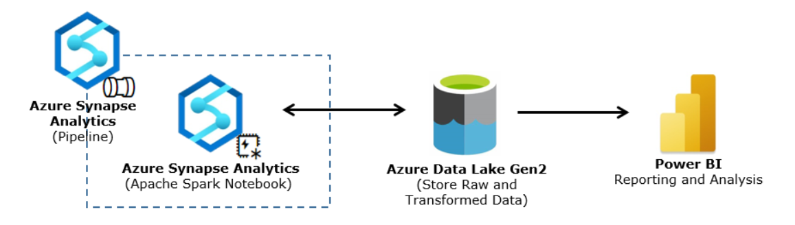
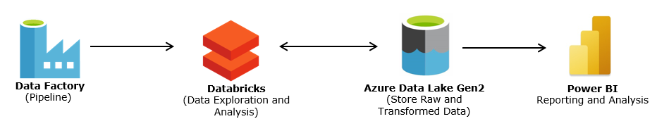

# SAEB Architecture Design

Authors: Arpit Dhindsa

## Overview

The Service Analytics Evidence Base (SAEB) architecture is scoped to the cloud data and analytics platform that will enable analytics and evidenced based improvements to the digital channel.

This "Lessons Learned" document is meant to be a repository of institutional memory for hard-won insights and understanding around the tools and technologies used to develop the SAEB architecture.                              

## Context

The initial development phase involved building an end-to-end data pipeline that ingests data into SAEB cloud, performs a transformation and pushes the transformed data to power BI dashboard for data visualization. 

The exercise made use of an unclassified dataset that was already present in the blob storage. To do this we explored two options: one using Data Factory and Databricks and another using Azure Synapse.

## Goals

The goal was to ingest and transform data using the pipelines. To do this following activities were performed:

- Create data pipeline using Azure Data Factory and Azure Databricks
- Create data pipeline using Azure Synapse
- Visualize data with Power BI

## End-to-end Data Pipeline 

The two end-to-end data pipelines were built using different technology stack:

- Azure Synapse
- Azure Data Factory with Azure Databricks

### Azure Synapse 

Azure Synapse is an analytics service that brings together enterprise data warehousing and big data analytics using Spark, Pipelines for data integration and ETL and integration with other services like Power BI. The notebooks support multiple languages.

The current state architecture with Azure Synapse is as follows:

This required to set up a linked service for Azure Data Lake Gen2 storage account. The Azure Synapse pipeline runs the notebook running on Apache Spark Pool that reads the dummy data available in the storage account, transform data to add a new column, and writes the transformed data back to the same storage account in the form of a csv. Lastly the data is visualized in Power BI desktop upon building connection with output file location in storage account with the use of Azure Data Lake Storage Gen2 connector.

### Azure Data Factory and Azure Databricks

Azure Data Factory (ADF) is a data integration and ETL tool. It allows to integrate various data sources and manage data both on-prem and in the cloud. It orchestrates the movement and transformation of data from various data stores.

Azure Databricks is an analytics platform based on Apache Spark. It offers notebook-oriented environment which makes it easy to explore and analyze data and manage clusters. It is cloud-based machine learning and big data platform that supports multiple languages.

The current state architecture utilizing Data Factory and Databricks is as follows:

Before building a data factory pipeline, linked service was created for Databricks Workspace and Azure Data Lake Gen2 storage account. ADF pipeline orchestrates the execution of Databricks notebook that reads data from storage container, transforms data to add a new column and lastly writes the transformed data to the same directory as the source file. From there the data is pushed to Power BI desktop with the help to Azure Data Lake Storage Gen2 connector which is given output file path. 

Power BI’s Databricks and Spark connector can also be used to connect to Databricks database. Both connectors allow you to connect directly to the data source using Direct Query which supports live data refresh as no data is copied to Power BI Desktop. As you create or interact with a visualization, Power BI Desktop queries the underlying data source, so you are always viewing current data. Tiles based on DirectQuery datasets refresh automatically according to a schedule by sending queries to the back-end data source. By default, datasets refresh every hour, but they can be configured as part of dataset settings to be between weekly and every 15 minutes. 

However, due to connection issues _(see Issue #1 in Unresolved Issues under Problem/Blockers)_, Data Lake Gen2 was chosen as the data source for Power BI. Azure Data Lake Storage Gen2 connector does not support Direct Query hence, the data needs to be refreshed manually to see underlying data changes since the initial import.

## Problems/Blockers

Multiple issues were faced when building these pipelines. Some of these have been resolved while others still exist. 

### Solved Issues
Issues solved to date include:
1. Unable to build Pipelines, Notebooks and set up linked service on Azure Synapse
   - _Solution:_ Grant users with Synapse Contributor rights to develop, debug, and publish code to the service
2. Unable to write to Azure Data Lake from Azure Synapse Notebook
   - _Solution:_ 
          - Grant `Azure Synapse` `Reader and Data Access` role on `Data Lake Storage Account` as this will only allow read/write access to the data contained in a storage account.
          - Grant users `Reader and Data Access` role to access the data within the storage account because the script runs under the users that execute the notebook. Solely giving users `Contributor` rights on storage account, does not give them access to the data in the lake but only allows them to manage the resource so, a data access role needs to be assigned to the user to access data within the storage account.
          - Add `user` and `synapse workspace` to `Access Control Lists (ACLs)` in `Data Lake storage` and give `Read, Write and Execute` permissions on directory to which the user needs to write the data to. Where Azure Role Based Access Control (RBAC) provides a “coarse-grain” level of access such as read or write access to all of the data in a storage account or container, ACLs give the ability to apply “finer grain” level of access to directories and files.
      
      Similarly `Azure Data Factory` was granted `Read and Data Access` role on `Azure Data Lake Gen2` storage account and `users` are added to built-in `Data Factory Contributor` role on the `Resource Group` that contains the Data Factory resource.
3. Unable to create Spark database in Azure Synapse
   - _Solution:_ Add `user` and `synapse workspace` to `ACLs` in `Data Lake storage` and give `Read, Write and Execute` permissions on `container` as the database tables are stored under a synapse directory that automatically gets created under the container once database is created in synapse workspace.

### Unresolved Issues
Issues pending to be solved:
1. Cannot connect Databricks database to Power BI Desktop
   - _Databricks connector error:_ "ODBC: ERROR [HY000] [Microsoft][DriverSupport] (2019) Invalid user agent entry."
   - _Spark connector error:_ "ODBC: ERROR [HY000] [Microsoft][ThriftExtension] (14) Unexpected response from server during a HTTP connection: connect() failed: errno = 10060."
2. Cannot connect Synapse Dedicated SQL Pool (SQL DW) to Power BI Desktop
   - _Azure Synapse Analytics (SQL DW) connector error:_ "Microsoft SQL: A network-related or instance-specific error occurred while establishing a connection to SQL Server. The server was not found or was not accessible. Verify that the instance name is correct and that SQL Server is configured to allow remote connections. (provider: Named Pipes Provider, error: 40 - Could not open a connection to SQL Server)"
3. Unable to write data to Synapse Dedicated SQL Pool
   - _Error:_ Login failed for user '<token-identified principal>'
   - _Possible Solution:_ Currently, the Access control within Synapse Studio does not apply to dedicated SQL pools. Workspace administrator can create a user manually through T-SQL or `add a user` through `SQL Active Directory Admin` option when navigating to `synapse workspace resource` in `Azure Portal`.
4. Building SharePoint - Azure Connection requires SharePoint tenant name and tenant ID.

## Tech Comparisons

### Azure Data Factory vs Synapse Pipelines

Azure Synapse Analytics offers codeless data integration capabilities like Azure Data Factory. Both offer the ability to build a data integration pipeline using graphical user interface without writing a single line of code. Most activities from ADF can be found in Synapse. Synapse has Spark notebooks and SQL pools which are not available in ADF and these activities do not require setting up linked services. Synapse allows creation of linked services like ADF to connect to various tools but, does not support SQL Server Integration Services (SSIS) package activity and Power Query activity. Data Factory SSIS integration runtime provides a fully managed execution environment for running SQL Server Integration Services packages. Data Factory supports integration runtime sharing that allows to share/move data across different data factories. Power Query is used for building code-free data preparation and wrangling workflows that are executed using spark. Synapse offers the ability to monitor Spark Jobs for Data FLow by leveraging Synapse Spark Pools.
   
Summary:
   
|**Feature**|**Azure Data Factory**|**Azure Synapse Analytics**|
|---|---|---|
|**Using SSIS and SSIS Integration Runtime**|✓|✗|
|**Integration Runtime Sharing**|✓|✗|
|**SSIS Package Activity**|✓|✗|
|**Support for Power Query Activity**|✓|✗|
|**GIT Integration**|✓|✓|
|**Monitoring of Spark Jobs for Data Flow**|✗|✓|

### Azure Databricks vs Synapse Spark Notebook

Azure Synapse Analytics offers similar functionalities as in Databricks through interactive notebooks for Spark development. Where Databricks supports Spark 3.0, Azure Synapse Spark Pools support Spark 2.4 for big data processing. Databricks notebooks support real-time co-authoring and automated versioning. Synapse notebooks have co-authoring but one must save the notebook before others see the changes and does not have automated versioning. Synapse notebook provide the ability to directly query the data lake from scripts and notebooks but in Databricks one needs to mount a data lake before accessing data. Databricks has machine learning optimized Databricks runtime, GPU enabled clusters, managed and hosted version of MLflow and support for AzureML. Synapse has built-in support for AzureML and open-source MLflow. Spark Structured Streaming as part of Databricks allows to works seamlessly for streaming data and real-time transformations. As a data warehouse, it is possible to ingest real-time data into Synapse using Stream Analytics.
   
Summary:
|**Feature**|**Azure Databricks**|**Azure Synapse Spark Notebooks**|
|---|---|---|
|**Real-time co-authoring**|✓|✗|
|**Automated versioning**|✓|✗|  
|**Querying Data Lake**|✓|✓|  
|**GPU-enabled clusters**|✓|✗|  
|**Delta Lake support**|✓|✓|  
|**AzureML support**|✓|✓|  
|**MLflow**|✓ (built-in)|✓ (open-source)|
|**Real-time Data Ingestion**|Spark Structured Streaming|Link to Azure Stream Analytics|

### Dedicated SQL Pool vs Serverless SQL Pool vs Spark Pools (Synapse)

Dedicated SQL Pool formerly known as Azure SQL Data Warehouse is a big data solution that stores and collects data in a relational table with columnar storage. It improves query performance and reduces storage cost as cost control is handled by pausing the SQL pool and allows to scale up or down depending on the needs. The size of a dedicated SQL pool is measured in Data Warehousing Units (dwu). It also allows you to query and ingest data from data lake files.

Serverless SQL Pool is a distributed data processing system used for storing and computing large-scale data. It does not require infrastructure set-up. Serverless SQL pool uses a pay-per-use model, so there is no charge for reserving the resources, the charge is based on the data processed by each query. It also allows you to query and ingest data from data lake files and stores data in the Data Lake.

Apache Spark Pool allows to analyze and process large volumes of data using Spark in multiple languages. It also comes with a machine learning library built on top of Spark which provides the ability to create machine learning applications.
   
Summary:
   
|**Feature**|**Spark Pool**|**Serverless SQL Pool**|**Dedicated SQL Pool**|
|---|---|---|---|
|**Querying Data Lake**|✓|✓|✓|  
|**Infratructure set-up**|✓|✗|✓| 
|**Storage**|Data Lake|Data Lake|Relational Tables| 
|**Cost**|Pay per executed Spark job|Pay per query|Pay per DWU (Data Warehouse Units) provisioned| 

## Next Steps

The next steps are to run this pipeline on meaningful data (most likely an excel file from SharePoint Online) rather than dummy data and build direct connection with existing Power BI report server requiring minimal human intervention. The goal will be to build a repeatable pipeline so that one runs the pipeline and as an end result the data is automatically refreshed in Power BI report server.
