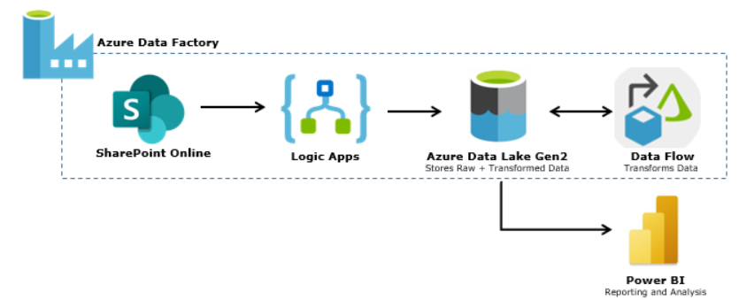
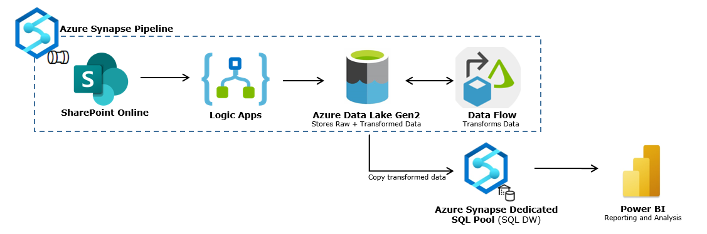
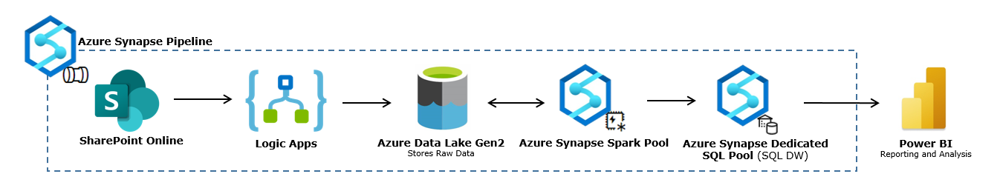
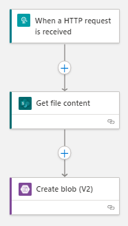
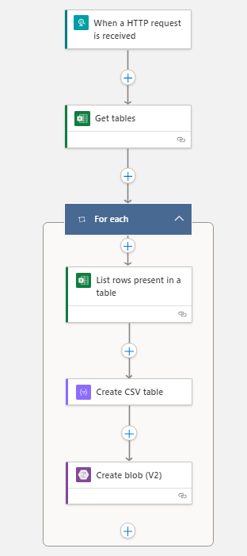

# SharePoint Online and Azure Integration

Authors: Arpit Dhindsa

## Overview

This "Lessons Learned" document is meant to be a repository of institutional memory for hard-won insights and understanding around the tools and technologies used to develop the SAEB architecture.                              

## Context

The development involved building an end-to-end data pipeline that ingests data into SAEB cloud, performs a transformation and pushes the transformed data to power BI dashboard for data visualization.

The exercise aimed to use data from SharePoint Online. To do this we explored two options: one using Azure Data Factory and another using Azure Synapse. With Azure Synapse we looked at two distinct approaches for data transformation: one using data flow and another using spark pools.

## Goals
The goal was to ingest and transform data from SharePoint Online using pipelines. To do this following activities were performed:
-	Create pipeline in Azure Data Factory 
-	Create pipeline in Azure Synapse using:
     - Data Flow
     - Spark Pool
- Visualize data with Power BI by establishing a direct connection (requiring no manual intervention)

## End-to-end Data Pipeline 

The three end-to-end data pipelines were built using:
1. Azure Data Factory 
2. Azure Synapse

### Azure Data Factory 

The current state architecture utilizing Data Factory is as follows:


  
This solution was built using Azure Data Factory due to insufficient permissions to execute a pipeline in synapse workspace. The ADF Pipeline runs a Logic Apps Workflow _(see Workflow #1 in Logic Apps Workflow)_ that pulls data from SharePoint Online and drops it in blob storage in excel file format. Then the raw data is passed to the data flow that transforms data to add a new column and stores transformed data in the storage account in a CSV file format. From there the data is pushed to powerBI desktop with the help of Azure Data Lake Storage Gen2 connector which is given the path to the CSV containing the transformed data. However, the data needs to be refreshed manually to see underlying data changes since the initial import.

### Azure Synapse 

Upon gaining permissions to run a synapse pipeline, two different pipelines were built in Azure Synapse to accomplish this task:
1. Using Data Flow
2. Using Spark Pool

#### Azure Synapse Pipeline using Data Flow

The current state architecture with Azure Synapse that leverages Data Flow for data transformation is as follows:



The synapse pipeline runs a Logic Apps Workflow _(see Workflow #1 in Logic Apps Workflow)_ that pulls data from SharePoint Online and drops it in the blob storage in excel file format. Then the raw data is passed to the data flow that transforms data to add a new column and stores transformed data in the storage account in a CSV file format. The transformed CSV is copied to Azure Synapse Dedicated SQL Pool using a SQL script and then pushed to powerBI desktop with the help of Azure Synapse Analytics connector. However, to this date, a successful connection has not been built between power BI and Azure Synapse Analytics _(see Issue #1 in Unresolved Issues under Problems/Blockers)_.

#### Azure Synapse Pipeline using Spark Pools

The current state architecture with Azure Synapse that leverages Azure Synapse Spark Pools for data transformation is as follows:



The synapse pipeline runs a Logic Apps Workflow _(see Workflow #2 in Logic Apps Workflow)_ that pulls data from SharePoint Online and drops it in the data lake in a CSV file format. Then the spark notebook reads raw CSV file and transforms data to add a new column and stores the transformed data in the Azure Synapse Dedicated SQL Pool to be pushed to powerBI desktop with the help of Azure Synapse Analytics connector. However, to this date, a successful connection has not been built between power BI and Azure Synapse Analytics _(see Issue #1 in Unresolved Issues under Problems/Blockers)_.

## Logic Apps Workflow

In this development exercise, Logic Apps were used to get data from SharePoint Online. Two distinct workflows were built to achieve this.

### Workflow 1

This workflow is executed by pipelines that transform data using Data Flow.



The workflow runs upon receiving an HTTP POST request from synapse pipeline Web Activity. Firstly, it gets contents from SharePoint Online excel file and then drops it in blob storage in excel file format. For SharePoint Online connector, you needs to Sign in to authenticate your user credentials.

### Workflow 2

This workflow is run by synapse pipeline that leverages Spark Notebook for data transformation activity



The workflow fires upon receiving an HTTP POST request from synapse pipeline Web Activity. Firstly, it gets excel tables from SharePoint Online excel file. To do this, you need to Sign in to authenticate your user credentials. Then for each table it lists rows and adds them to a csv table. Lastly the csv file is dropped in the blob storage. In this case, we only had one table in SharePoint Online excel file.

## Problems/Blockers

Multiple issues were faced when building these pipelines. Some of these have been resolved while others still exist. 

### Solved Issues

Issues solved to date include:
1. Unable to trigger/debug Azure Synapse Pipelines
     - _Solution:_ Grant `users` with `Synapse Credential User` rights to execute/run pipelines in `Azure Synapse Workspace`
2. Unable to view the Dedicated SQL Pool
     - _Solution_: Ask administrator to:
        - Create the user in the database by running the following command on the target database          
                ``` 
                CREATE USER '<alias@domain.com>' FROM EXTERNAL PROVIDER;
                ```             
        - Grant the user a role to access the database  
                ```
                EXEC sp_addrolemember 'db_owner', '<alias@domain.com>';
                ```              
3.	Unable to create tables in Dedicated SQL Pool from Spark Notebook (using spark pools)
      -	_Error_: 
            ```
            "com.microsoft.spark.sqlanalytics.exception.SQLAnalyticsConnectorException: com.microsoft.sqlserver.jdbc.SQLServerException: CREATE EXTERNAL TABLE AS SELECT statement failed as the path name 'abfss://saeb-dlstorage-filesystem@saebdlstorageg2.dfs.core.windows.net/synapse/workspaces/saeb-data-analytics-workspace-2/sparkpools/ASP1scaling/sparkpoolinstances/6c183999-a58e-4295-bd6c-ac0bba99362c/livysessions/2021/10/06/61/tempdata/SQLAnalyticsConnectorStaging/application_1633560253780_0003/asJgDjl4w201a126a9bb89b4c24a7ec4f0c6669381e.tbl' could not be used for export. Please ensure that the specified path is a directory which exists or can be created, and that files can be created in that directory..."
            ```
      -	_Solution_: Add `user` and `synapse workspace` to `ACLs in Data Lake storage` and give `Read, Write and Execute` permissions on 'sparkpools' folder under workspace directory that lies under the synapse directory which gets created under the container once database is created in a synapse workspace. Same permissions need to be granted to the folder with your spark pool name under 'sparkpools' folder.

### Unresolved Issues

Issues pending to be solved:
1. Cannot connect Synapse Dedicated SQL Pool (SQL DW) to Power BI Desktop
     -	_Azure Synapse Analytics (SQL DW) connector error:_ "Microsoft SQL: A network-related or instance-specific error occurred while establishing a connection to SQL Server. The server was not found or was not accessible. Verify that the instance name is correct and that SQL Server is configured to allow remote connections. (provider: Named Pipes Provider, error: 40 - Could not open a connection to SQL Server)"
     -	_Steps taken to resolve the problem:_
        -	Create SQL Login to authenticate connection with PowerBI desktop
             ```
             USE MASTER
             CREATE LOGIN "<alias@domain.com>" WITH PASSWORD = '<password>';
             CREATE USER "<alias@domain.com>" FROM LOGIN "<alias@domain.com>";
             ```
        -	Add IP address in the Networking Tab under Security Section of Azure Synapse workspace resource in Azure Portal to give full access to the workspace 

## Next Steps
The next step is to build connection between Azure Synapse Analytics and existing Power BI report server. The goal will be to build a repeatable pipeline so that one runs the pipeline and as an end result the data is refreshed in Power BI report server.

